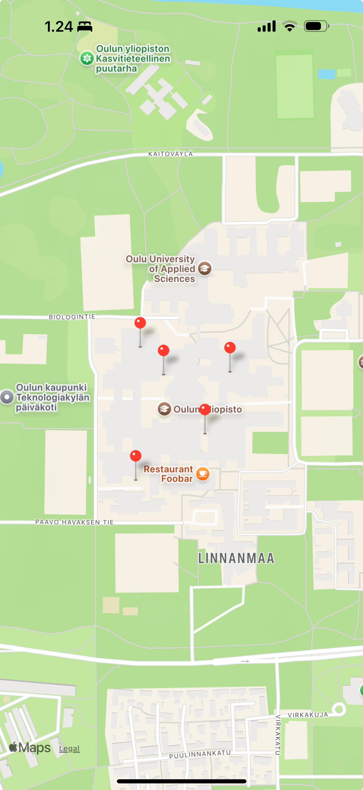

# Web-ja-hybriditeknologiat-mobiiliohjelmoinnissa-viikkotehtava-5

## Excercise. Todo list

Create an app, that displays a map that open at the user’s location. User can add multiple markers to the map.

Requirements for the app are as follows.
• Map is displayed.
• User’s location is retrieved, and map is opened at that location.
• User can add marker(s) by pressing map (longpress event), there is no need to
provide title or other information, or save markers (e.g. AsyncStorage).

## Implemented UI

